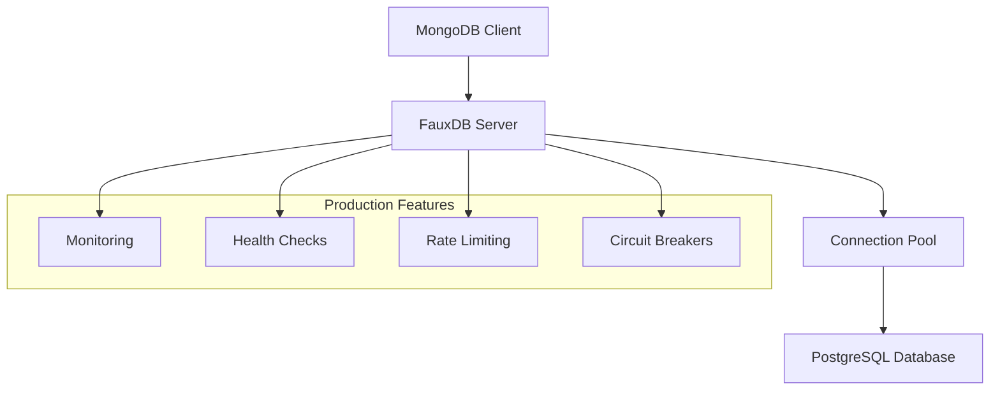

# FauxDB Documentation

Welcome to FauxDB - the MongoDB-compatible server built on PostgreSQL with production-ready features.

## What is FauxDB?

FauxDB is a high-performance, production-ready MongoDB-compatible server that runs on top of PostgreSQL. It provides full MongoDB 5.0+ API compatibility while leveraging PostgreSQL's robust ACID transactions, advanced indexing, and enterprise-grade reliability.

## Key Features

- **MongoDB 5.0+ Compatibility**: Full wire protocol support
- **PostgreSQL Backend**: ACID transactions, advanced indexing, enterprise reliability
- **Production Ready**: Connection pooling, monitoring, health checks, graceful shutdown
- **High Performance**: Optimized for concurrent operations and large datasets
- **Enterprise Security**: Authentication, authorization, rate limiting, circuit breakers
- **Observability**: Comprehensive metrics, logging, and monitoring

## Architecture



## Quick Start

Get started with FauxDB in minutes:

```bash
# Install FauxDB
cargo install fauxdb

# Start FauxDB server
fauxdb --config config/fauxdb.toml

# Connect with mongosh
mongosh mongodb://localhost:27017
```

## Documentation Structure

- **[Quick Start](quick-start.md)** - Get up and running in 5 minutes
- **[Installation](installation.md)** - Detailed installation instructions
- **[Configuration](configuration.md)** - Server configuration options
- **[API Reference](api/index.md)** - Complete API documentation
- **[Production Guide](production-guide.md)** - Production deployment guide
- **[Examples](examples/index.md)** - Code examples and tutorials

## MongoDB Compatibility

FauxDB implements the complete MongoDB 5.0+ wire protocol, supporting:

- All CRUD operations
- Aggregation pipelines
- Indexes and query optimization
- Transactions
- Change streams
- GridFS
- Authentication and authorization

## Production Features

FauxDB includes enterprise-grade features for production deployments:

- **Connection Pooling**: Efficient connection management
- **Health Monitoring**: Comprehensive health checks and metrics
- **Rate Limiting**: Configurable request rate limits
- **Circuit Breakers**: Automatic failure detection and recovery
- **Graceful Shutdown**: Clean shutdown with connection draining
- **Observability**: Prometheus metrics, structured logging

## Getting Help

- 📚 **Documentation**: Browse the comprehensive documentation
- 🐛 **Issues**: Report bugs on [GitHub Issues](https://github.com/pgelephant/fauxdb/issues)
- 💬 **Discussions**: Join the community on [GitHub Discussions](https://github.com/pgelephant/fauxdb/discussions)
- 📧 **Support**: Contact the team for enterprise support

## License

FauxDB is released under the MIT License. See [LICENSE](https://github.com/pgelephant/fauxdb/blob/main/LICENSE) for details.

---

**Ready to get started?** Check out our [Quick Start Guide](quick-start.md) or jump to [Installation](installation.md).
